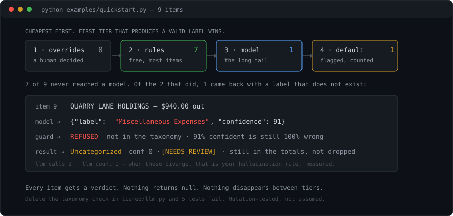

# tiered-classifier

**Your model returned "Software & Subscriptions". Your taxonomy says "Software Subscriptions". Now what?**

Downstream, that value looks exactly like a real label. Nothing errors. You find
out months later, in an audit, or when a report silently omits a category.

This is a labeling pipeline where that cannot happen: the model's answer is
checked against a closed vocabulary before it is allowed out, and a label that
isn't in the set isn't a low-confidence answer — it's **not an answer**.



Four tiers, cheapest first. **Every item gets a verdict** — nothing is dropped,
nothing returns null, nothing vanishes between tiers. The item nobody could
label comes out flagged and still appears in the totals.

## What it looks like

```console
$ python examples/quickstart.py

llm tier: label 'Miscellaneous Expenses' is not in the taxonomy (item 9) -- falling through
id  source      conf  label                   text
--------------------------------------------------------------------------------------------
1   rule          97  Cloud Infrastructure    AMAZON WEB SERVICES AWS.AMAZON
2   rule          97  Payroll                 GUSTO PAYROLL 7741
3   rule          98  Sales Revenue           STRIPE PAYOUT ST-A41K
4   rule          95  Software Subscriptions  GITHUB INC
5   rule          85  Internal Transfer       TRANSFER TO SAVINGS 2210   [NOT_AN_EXPENSE]
6   rule          80  Meals & Entertainment   DOORDASH*TEAM LUNCH   [PERSONAL_REVIEW]
7   rule          40  Uncategorized           CHECK #2231   [NEEDS_PAYEE]
8   llm           78  Legal & Professional    NOVA RIDGE PARTNERS LLC
9   default        0  Uncategorized           QUARRY LANE HOLDINGS   [NEEDS_REVIEW]
--------------------------------------------------------------------------------------------
9 items  |  0 override, 7 rule, 1 model, 1 default
78% decided without a model call  |  2 model call(s) attempted, 1 accepted  |  5 flagged for review
```

That first line is the guard's own log, on stderr, as it happens.

Items 8 and 9 were the only two the rules could not place, so they were the only
two that cost a model call. The model got 8 right. For 9 it invented
`Miscellaneous Expenses`; the guard refused it, and 9 came out flagged instead of
entering the record as a category that does not exist.

## Use it

```bash
pip install -r requirements.txt
python examples/quickstart.py      # no API key, no network
pytest -q                          # 34 tests, offline
```

```python
from tiered.engine import classify
from tiered.models import Item

result = classify(items, taxonomy, rules=my_rules, completer=my_model)

for v in result.items:
    print(v.label, v.source, v.confidence, v.flag)

print(result.stats.rule_hit_rate)   # share that never touched a model
```

`completer` is any callable from prompt to string, so no SDK is imported here
and the tests run offline. Three lines wires your provider:

```python
def completer(prompt: str) -> str:
    return client.messages.create(
        model="...", max_tokens=300, temperature=0,
        messages=[{"role": "user", "content": prompt}],
    ).content[0].text
```

It's also **useful before you have a model at all.** Leave `completer=None`, run
your rules, and read `rule_hit_rate`. That tells you whether the model tier is
worth paying for before you pay for it.

## Why it's built this way

**The guard is the point.** [`tiered/llm.py`](tiered/llm.py) validates the
returned label against the taxonomy and returns `None` on a miss, so the caller
falls through. Confidence does not rescue an invalid label — a model that is
100% sure about a category you don't have is 100% wrong. Five tests fail if you
delete that check; it was mutation-tested, not assumed.

**Rules are records, not code.** A `Rule` is a frozen dataclass: pattern, label,
confidence, and an optional flag with a human-readable reason. Ordered list,
first match wins. Adding coverage means appending a record — the matching
function never changes. Because each rule carries its own reason, whatever fires
already knows how to explain itself.

**Confidence and flags are separate ideas.** A rule can match at 95% and still
flag for review (a meal is probably a meal, and might still be personal). A rule
can match at 40% and be the best available answer. Both get counted.

**Tier stats are first-class.** `llm_calls` counts attempts, `llm_count` counts
accepted answers. When those diverge, the model is hallucinating and you can
measure how often.

**Every failure mode falls through, none crash.** Provider raised, response
wasn't JSON, JSON had no label, label was invented — each logs and returns
`None`. A silent fallthrough you cannot count is how you end up believing your
rules cover more than they do.

## Not just transactions

The example taxonomy is expenses because that's where this came from — a
production pipeline that read bank statements and mapped them to a chart of
accounts. The shape is domain-free: an `Item` is an id, some text, and two
optional fields. Support tickets, content categories, product taxonomies,
document types — same four tiers, same guard, swap the ruleset.

## What isn't here

No provider SDKs, no prompt-chaining framework, no vector store, no agent loop.
It labels things against a fixed vocabulary and tells you honestly which tier
did it.

MIT licensed.
